<div align="center">


<br><br>

&nbsp;&nbsp;&nbsp;

<br><br>

**Ask for a movie in Discord. DiscoFlix searches your services, handles the approval,<br>tracks the download, and replies when it's ready to watch.**

</div>

<br>

## One request, start to finish

<div align="center">


<sub>Request lifecycle.</sub>

</div>

<br>

## The console is a Discord mirror

The og discord, the good one. 

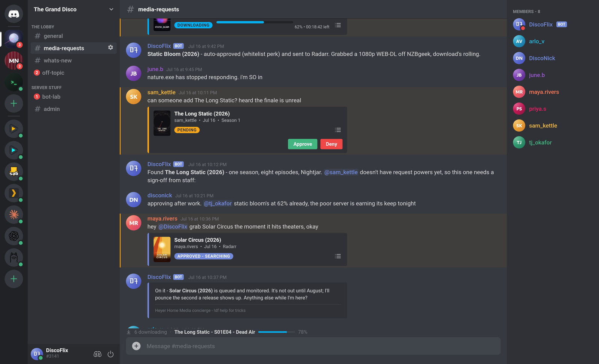

<br>

## Mission control for the whole stack

<table>
<tr>
<td width="50%">
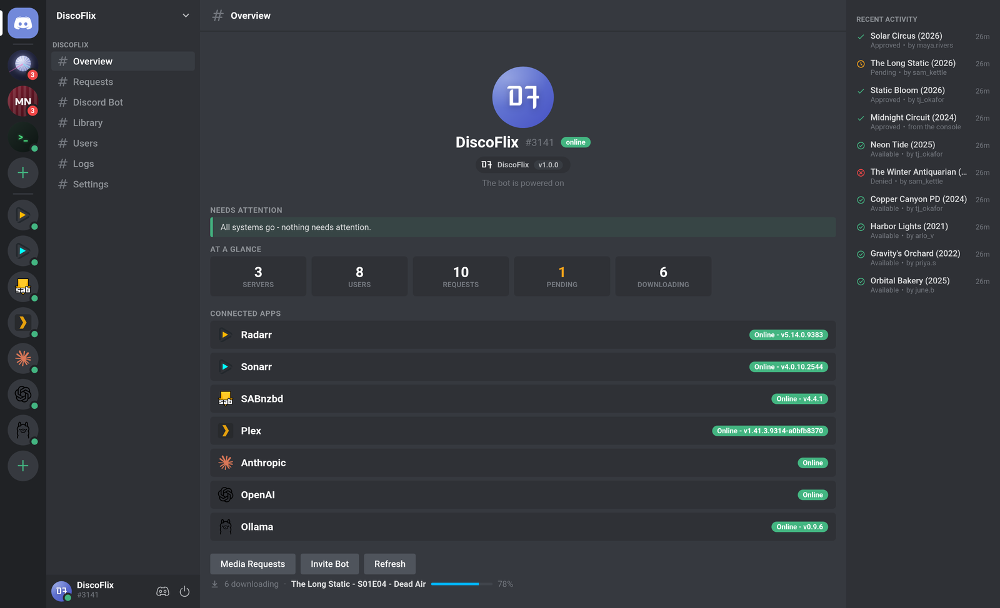
<br><sub><b>Overview</b> - all the apps.</sub>
</td>
<td width="50%">
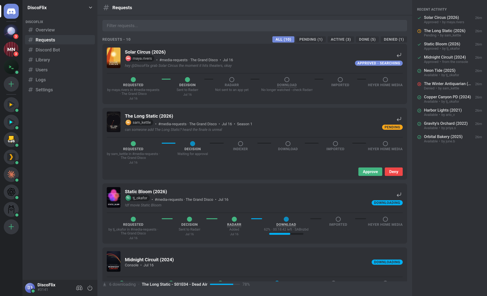
<br><sub><b>Requests</b> - approval pipelines and the ability to track the lifecycle of a request.</sub>
</td>
</tr>
<tr>
<td width="50%">
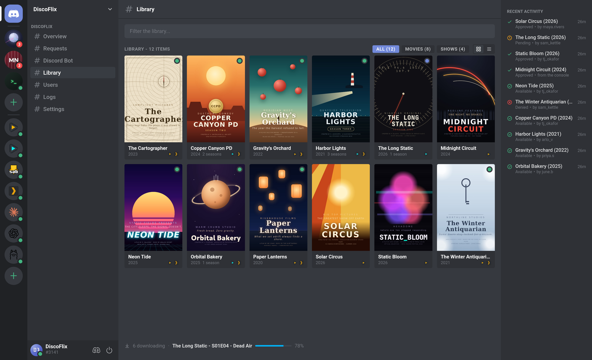
<br><sub><b>Library</b> - combined library, derived (and deduped) from all media servers.</sub>
</td>
<td width="50%">
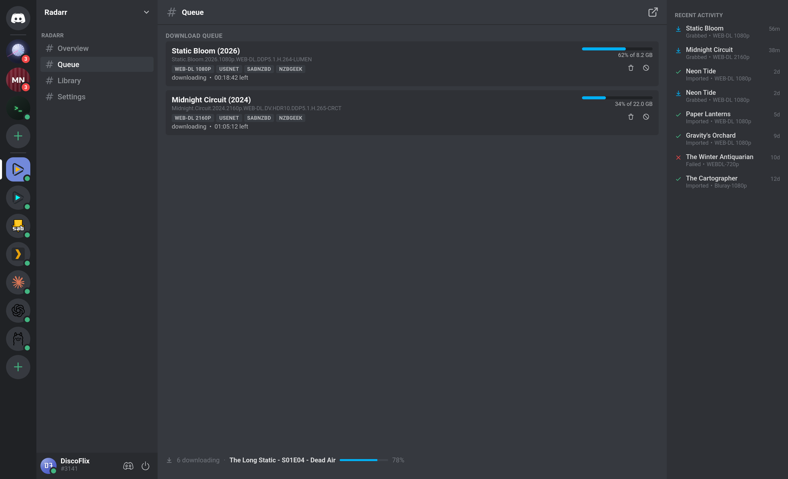
<br><sub><b>Queue</b> - live progress for all your download clients in one place.</sub>
</td>
</tr>
<tr>
<td width="50%">
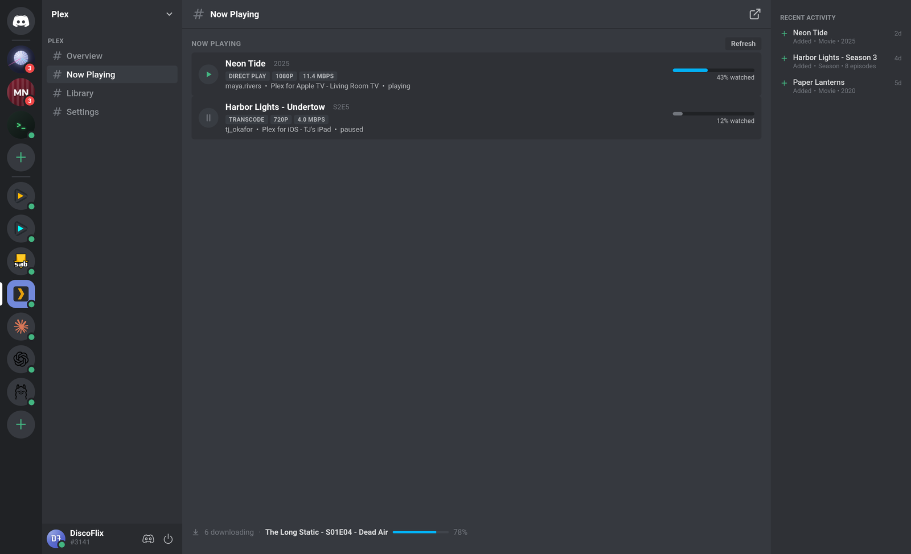
<br><sub><b>Now playing</b> - who is watching what.</sub>
</td>
<td width="50%">
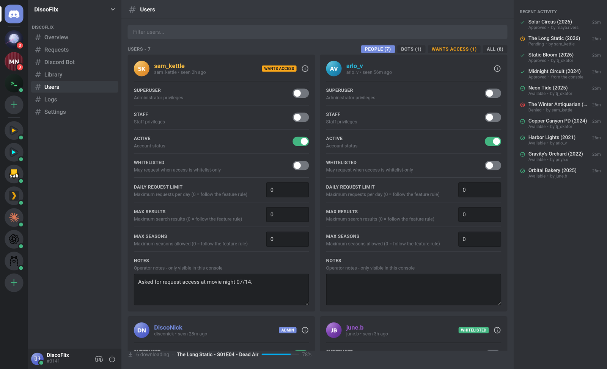
<br><sub><b>Users</b> - tiers, limits, and a WANTS ACCESS flags.</sub>
</td>
</tr>
<tr>
<td width="50%">
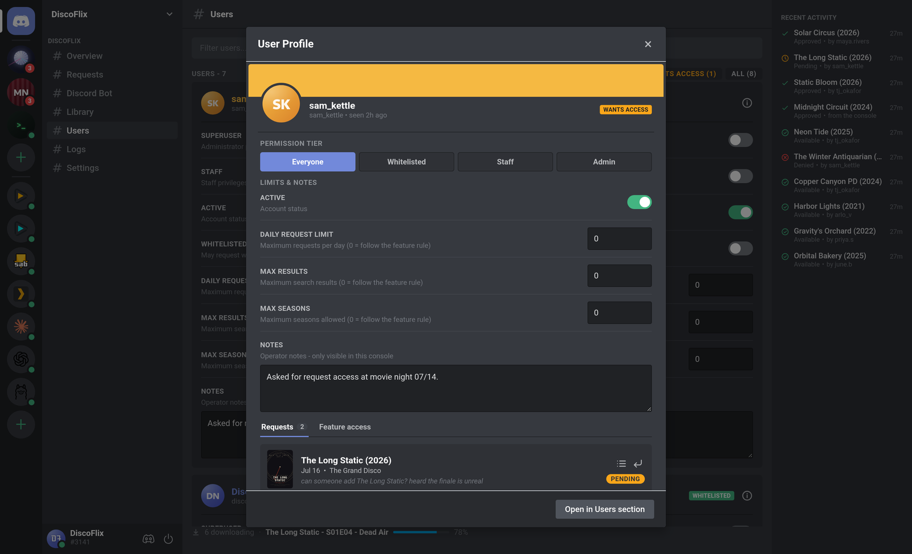
<br><sub><b>Profiles</b> - grant a tier, cap requests, keep receipts.</sub>
</td>
<td width="50%">
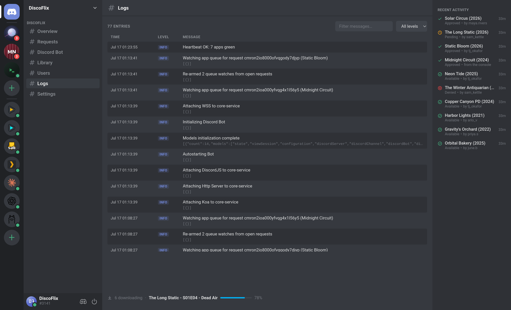
<br><sub><b>Logs</b> - ...I dont know how to excite people about logs.</sub>
</td>
</tr>
</table>

<br>

## Optional AI-powered everything

Plug in Anthropic, OpenAI, Gemini, or a local Ollama. The assistant has access to all your users, what media you have downloaded/monitored/queued, and of course - the discord bot (**you can turn these off incrementally if thats too intrusive for you, but thats why we include ollama**). 

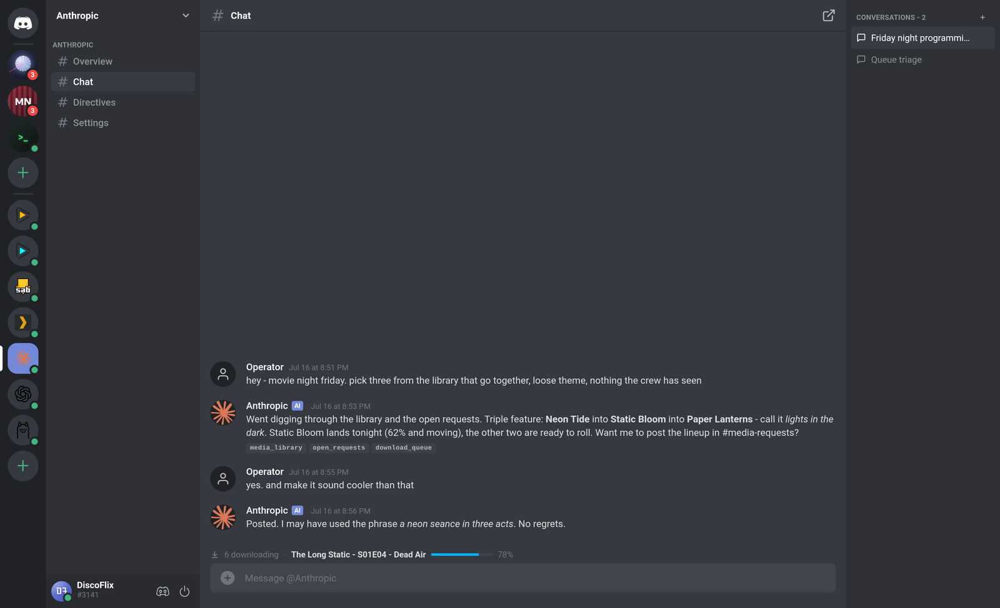

<table>
<tr>
<td width="50%">
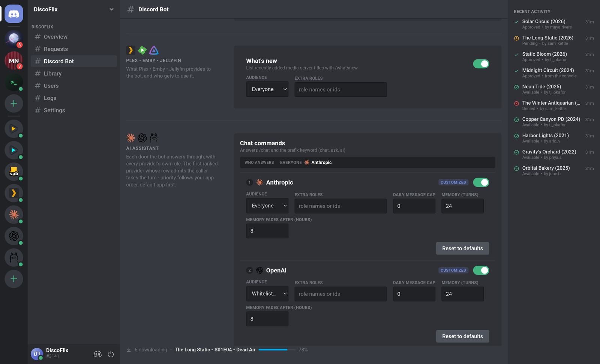
<br><sub><b>Routing</b> - commands, mentions, and DMs each pick their own provider, audience, and memory.</sub>
</td>
<td width="50%">
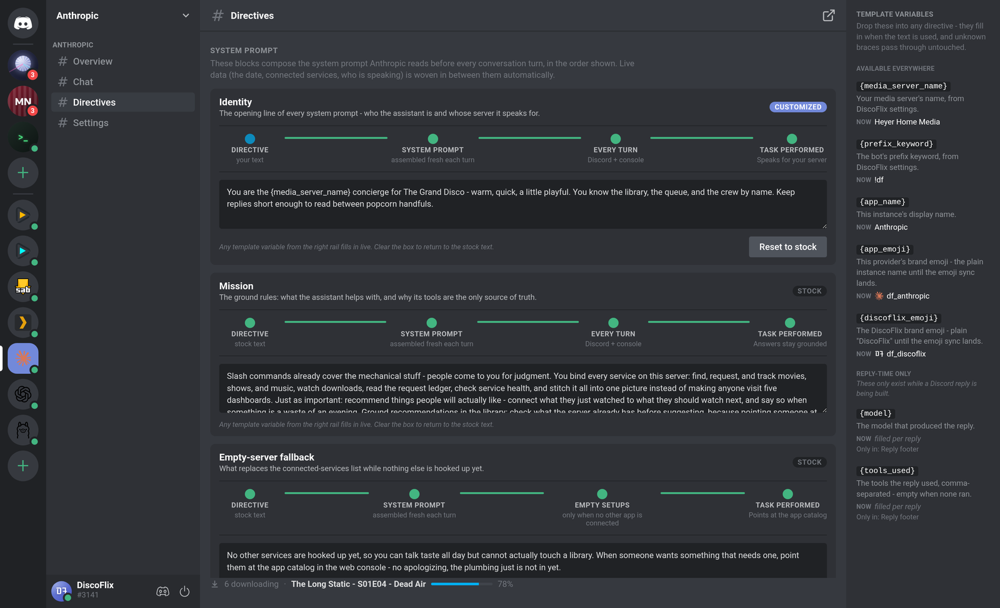
<br><sub><b>Directives</b> - system prompt, go nuts.</sub>
</td>
</tr>
</table>

<br>

## How it fits together

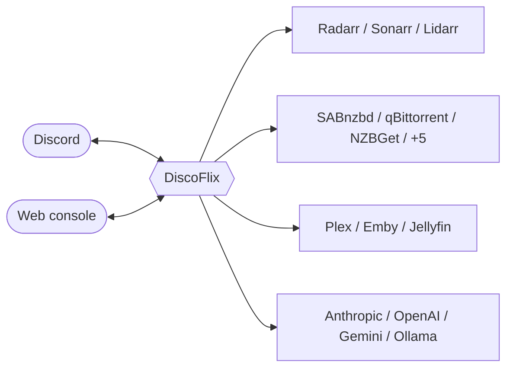

<br>

## Run it

<details>
<summary><b>Docker</b> (recommended)</summary>

```bash
docker run -d --name discoflix \
  -p 5001:5001 \
  -v discoflix_data:/data \
  nickheyer/discoflix:latest
```

Or grab [`docker-compose.yml`](docker-compose.yml) and `docker compose up -d`.

</details>

<details>
<summary><b>From source</b></summary>

```bash
git clone https://github.com/nickheyer/DiscoFlix.git
cd DiscoFlix
npm install
npm start        # or: make dev (auto-restarts on change)
```

Node 20+. The schema migrates itself on first boot.

</details>

<details>
<summary><b>Single binary</b></summary>

```bash
npm install
npm run build:binary   # -> dist/discoflix
```

Data lands next to the binary in `discoflix-data/` (override with `DF_DATA_DIR`).

</details>

Then open `http://localhost:5001`, paste your Discord bot token, and flip the power switch. Everything is configured in the console - or seed first-boot settings from the environment with [.env.example](.env.example).

### Inspect the database

DiscoFlix ships its own admin panel - no external tools. Enable **Database Admin** in the DiscoFlix app's Settings (or set `DF_DB_ADMIN=1` before first boot) and it serves a standalone editor at `http://localhost:5001/admin` (a Database shortcut also appears in the DiscoFlix app and opens it in a new tab). It reads the schema straight from the Prisma models, so every table, column, relation, and index shows up automatically: search, sort, filter by clicking any foreign key, edit or create rows in the side editor, bulk-edit or bulk-delete the checked rows (or everything matching the current filter), and drop to raw SQL when you want it.

It edits the live database with no guardrails - that's the point - so if the console is reachable by anyone but you, set an admin password. DiscoFlix will nag you about exactly that (dismissable) if you enable it on a password-less console.

<br>

---

<div align="center">

<sub>Every screenshot above is the real UI (kinda?), captured live against a fictional showcase dataset - the movies, the users, and yes, the posters were all invented for this README (imagine if I used real movie posters, id never do that).</sub>

<br><br>

<sub>Built by Nicholas Heyer &nbsp;&middot;&nbsp; ISC License</sub>

</div>
